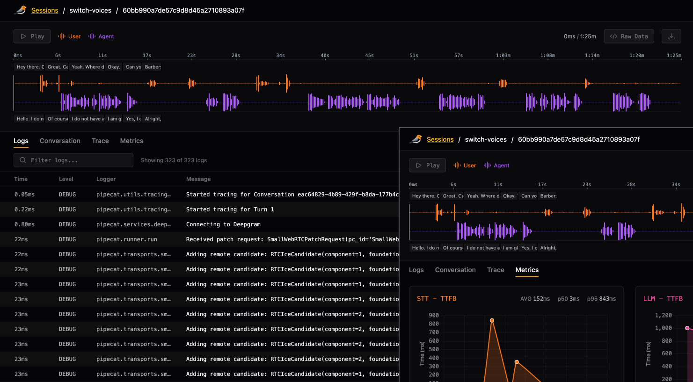

#  Finchvox - Voice AI Observability, Elevated.

Meet Finchvox, local session replay purpose-built for Voice AI apps.

Finchvox unifies conversation audio, logs, traces, and metrics in a single UI, highlighting voice-specific problems like interruptions and high user <-> bot latency. Finchvox is currently designed for local, development usage.

Visit [Finchvox.dev](https://finchvox.dev) to signup for our production-ready hosted and self-hosted options.

_👇 Click the image for a short video:_
<a href="https://github.com/user-attachments/assets/f093e764-82ae-41cb-9089-4e2d19c7867f" target="_blank"></a>

## Table of Contents

- [Prerequisites](#prerequisites)
- [Installation](#installation)
- [Setup](#setup)
- [Configuration](#configuration)
- [Usage](#usage---finchvox-server)
- [S3 Storage](#s3-storage)
- [Troubleshooting](#troubleshooting)
- [Telemetry](#telemetry)

## Prerequisites

- Python 3.10 or higher
- Pipecat 0.0.68 or higher

## Installation

```bash
# uv
uv add finchvox "pipecat-ai[tracing]"

# Or with pip
pip install finchvox "pipecat-ai[tracing]"
```

## Setup

1. Add the following to the top of your bot (e.g., `bot.py`):

```python
import finchvox
from finchvox import FinchvoxProcessor

finchvox.init(service_name="my-voice-app")
```

2. Add `FinchvoxProcessor` to your pipeline, ensuring it comes after `transport.output()`:

```python
pipeline = Pipeline([
    # SST, LLM, TTS, etc. processors
    transport.output(),
    FinchvoxProcessor(), # Must come after transport.output()
    context_aggregator.assistant(),
])
```

3. Initialize your `PipelineTask` with metrics, tracing and turn tracking enabled:

```python
task = PipelineTask(
    pipeline,
    params=PipelineParams(enable_metrics=True),
    enable_tracing=True,
    enable_turn_tracking=True,
)
```

## Configuration

The `finchvox.init()` function accepts the following optional parameters:

| Parameter      | Default                   | Description                                               |
| -------------- | ------------------------- | --------------------------------------------------------- |
| `endpoint`     | `"http://localhost:4317"` | Finchvox collector endpoint                               |
| `insecure`     | `True`                    | Use insecure gRPC connection (no TLS)                     |
| `capture_logs` | `True`                    | Send logs to collector alongside traces                   |
| `log_modules`  | `None`                    | Additional module prefixes to capture (e.g., `["myapp"]`) |

By default, logs from `pipecat.*`, `finchvox.*`, `__main__`, and any source files in your project directory are captured. Use `log_modules` to include additional third-party modules.

## Usage - Finchvox server

```bash
uv run finchvox start
```

For the list of available options, run:

```bash
uv run finchvox --help
```

## S3 Storage

Finchvox supports S3-compatible object storage as an alternative to local filesystem storage. When enabled, finalized sessions are automatically uploaded to S3 and can be listed/viewed from the UI.

### CLI Options

```bash
finchvox start --storage=s3 --s3-bucket=mybucket --s3-region=us-east-1
```

| Option | Default | Description |
|--------|---------|-------------|
| `--storage` | `local` | Storage backend type (`local` or `s3`) |
| `--s3-bucket` | - | S3 bucket name (required when `--storage=s3`) |
| `--s3-region` | `us-east-1` | AWS region |
| `--s3-prefix` | `sessions` | S3 key prefix for session data |
| `--s3-endpoint` | - | Custom endpoint URL (for S3-compatible services) |

### Environment Variables

All S3 options can also be configured via environment variables:

```bash
export FINCHVOX_STORAGE=s3
export FINCHVOX_S3_BUCKET=mybucket
export FINCHVOX_S3_REGION=us-east-1
export FINCHVOX_S3_PREFIX=sessions
export FINCHVOX_S3_ENDPOINT=http://localhost:4566  # Optional, for LocalStack
```

### S3 Data Structure

Sessions are stored with time-partitioned prefixes for efficient listing:

```
s3://bucket/sessions/2024/02/07/{session_id}/
├── manifest.json
├── trace_{session_id}.jsonl
├── logs_{session_id}.jsonl
├── environment_{session_id}.json
└── audio.opus
```

### Using with LocalStack

For local development and testing, you can use [LocalStack](https://localstack.cloud/):

```bash
docker run -d -p 4566:4566 localstack/localstack
aws --endpoint-url=http://localhost:4566 s3 mb s3://test-bucket
finchvox start --storage=s3 --s3-bucket=test-bucket --s3-endpoint=http://localhost:4566
```

## Troubleshooting

### No spans being written

1. Check collector is running: Look for "OTLP collector listening on port 4317" log message
2. Verify client endpoint: Ensure Pipecat is configured to send to `http://localhost:4317`

## Telemetry

FinchVox collects minimal, anonymous usage telemetry to help improve the project. No personal data, IP addresses, or session content is collected.

**What's collected:**

- Event type (`server_start`, `session_ingest`, `session_view`)
- FinchVox version
- Operating system (macOS, Linux, or Windows)
- Timestamp

**Disable telemetry:**

```bash
finchvox start --telemetry false
```

Or set the environment variable:

```bash
export FINCHVOX_TELEMETRY=false
```
